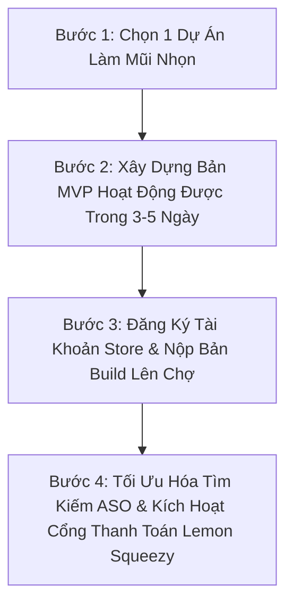

# 🚀 CHIẾN LƯỢC MỞ RỘNG DỰ ÁN KIẾM TIỀN MỚI
## Kế Hoạch Phát Triển Ứng Dụng Đăng Tải Lên Microsoft Store & Chrome Web Store

> **Phiên bản:** 1.0 (Dành cho Nhà phát triển Cá nhân / Solo Indie Hacker)  
> **Mục tiêu:** Tạo dòng tiền thụ động từ thị trường quốc tế với chi phí vận hành $0/tháng.  
> **Ngân sách khởi điểm:** ~$24 USD (Phí mở tài khoản Store một lần duy nhất).

---

## 1. TỔNG QUAN CHIẾN LƯỢC & TẠI SAO LẠI CHỌN CHỢ TRỰC TUYẾN?

### 1.1 Vấn đề của việc tự tìm khách hàng (Outreach thủ công):
- Phải liên tục gửi email, cold call, chăm sóc khách hàng doanh nghiệp (B2B).
- Tốn nhiều thời gian và phụ thuộc vào đàm phán từng hợp đồng.

### 1.2 Lợi thế đột phá của việc đăng lên Chợ Trực Tuyến (App Store / Extension Store):
1. **Lượng tìm kiếm tự nhiên khổng lồ (Organic Search Traffic)**:
   - Hàng triệu người dùng mỗi ngày chủ động lên Microsoft Store và Chrome Web Store gõ từ khóa tìm công cụ giải quyết vấn đề (ví dụ: *"screen ocr"*, *"extract table to excel"*, *"auto reply reviews"*).
   - Bạn không cần tốn tiền chạy quảng cáo Facebook/Google Ads.
2. **Độ tin cậy tuyệt đối (Trust & Zero SmartScreen Warning)**:
   - Người dùng bấm "Cài đặt" trong 1 giây, không bị hệ điều hành cảnh báo virus hay file không rõ nguồn gốc.
3. **Chi phí duy trì gần như bằng $0 (Zero Server Cost)**:
   - Ứng dụng chạy trực tiếp trên máy người dùng (Client-Side) hoặc trong trình duyệt, không tốn tiền thuê máy chủ cấu hình khủng.
4. **Thanh toán toàn cầu tự động**:
   - Thu tiền qua thẻ quốc tế (USD/EUR) thông qua cổng Lemon Squeezy hoặc Store Native In-App Purchase. Tiền tự động kết chuyển về tài khoản ngân hàng Việt Nam.

---

## 2. NGHIÊN CỨU 3 DỰ ÁN TIỀM NĂNG NHẤT (THE BIG 3)

Qua phân tích nhu cầu tìm kiếm và khoảng trống thị trường (Market Gap), dưới đây là 3 dự án khả thi nhất để triển khai ngay:

---

### 🏆 DỰ ÁN 1: OmniScrape AI — Tiện Ích Trích Xuất Dữ Liệu Web 1-Click
* **Nền tảng mục tiêu:** Chrome Web Store & Edge Add-ons Store.
* **Đối tượng người dùng:** Nhân viên bán hàng, môi giới bất động sản, nhà nghiên cứu thị trường, người làm affiliate marketing, chủ shop online.
* **Vấn đề nhức nhối (Pain Point):**
  - Muốn lấy danh sách số điện thoại, email, giá sản phẩm từ các website (Google Maps, Shopee, Amazon, danh bạ vàng).
  - Không biết lập trình Python/cào dữ liệu; các công cụ cào web hiện nay (Octoparse, ParseHub) quá phức tạp và đắt đỏ ($89 - $199/tháng).
* **Giải pháp của chúng ta (UVP):**
  - Người dùng mở bất kỳ trang web nào -> Bấm biểu tượng Extension -> Công cụ tự động phát hiện danh sách/bảng biểu -> Hiện nút **"Xuất ra Excel / Google Sheets"** chỉ với 1 cú click.
* **Công nghệ phát triển:**
  - HTML, CSS, JavaScript thuần (Chrome Extension Manifest V3).
  - Hoạt động 100% trên trình duyệt người dùng -> Không tốn 1 đồng chi phí server backend!
* **Mô hình kiếm tiền (Monetization):**
  - *Bản Miễn Phí (Free):* Xuất tối đa 50 dòng dữ liệu/ngày.
  - *Bản Pro ($19 mua trọn đời hoặc $4.99/tháng qua Lemon Squeezy):* Xuất không giới hạn số dòng, tự động cuộn trang (Auto-scroll), tải ảnh hàng loạt, xuất trực tiếp sang webhook n8n/Make.com.

---

### 🖥️ DỰ ÁN 2: SnapOCR & QuickAction — Tiện Ích Nhận Diện Chữ & Dịch Màn Hình Windows
* **Nền tảng mục tiêu:** Microsoft Store (Windows 10 / Windows 11).
* **Đối tượng người dùng:** Dân văn phòng, lập trình viên, học sinh/sinh viên, người học ngoại ngữ, chuyên viên tài chính đọc báo cáo PDF dạng ảnh.
* **Vấn đề nhức nhối (Pain Point):**
  - Rất nhiều văn bản không thể bôi đen copy được (chữ trong ảnh, video YouTube, file PDF scan khoá mật khẩu, bảng biểu trong phần mềm kế toán cũ).
  - Công cụ Snipping Tool của Windows chỉ chụp ảnh, không có tính năng dịch nhanh hoặc tự động chuyển bảng ảnh thành file Excel.
* **Giải pháp của chúng ta (UVP):**
  - Bấm phím tắt toàn cầu `Win + Shift + C` -> Quét vùng màn hình.
  - Tự động nhận diện chữ (OCR) siêu tốc 0.2 giây bằng thư viện nội tại Windows (`Windows.Media.Ocr`).
  - Menu thao tác nhanh xuất hiện:
    1. *Copy văn bản sạch*
    2. *Chuyển bảng số liệu thành bảng Markdown / Excel*
    3. *Dịch sang tiếng Việt / tiếng Anh bằng 1 phím bấm*
* **Công nghệ phát triển:**
  - C# WinUI 3 / WPF hoặc Web App đóng gói MSIX bằng công cụ chính thức **PWABuilder của Microsoft**.
* **Mô hình kiếm tiền (Monetization):**
  - *Bản Miễn Phí (Free):* Đầy đủ chức năng nhận diện chữ cơ bản.
  - *Bản Pro ($9.99 hoặc $14.99 trọn đời):* Mở khóa nhận diện bảng tính phức tạp, dịch tự động không giới hạn, lưu lịch sử quét clipboard.

---

### 🏪 DỰ ÁN 3: ReviewGenius Local Pro — Trợ Lý Viết Đánh Giá Google Maps & B2B
* **Nền tảng mục tiêu:** Chrome Web Store.
* **Đối tượng người dùng:** Chủ nhà hàng, quán cà phê, phòng khám nha khoa, khách sạn, salon tóc quản lý Google Business Profile.
* **Vấn đề nhức nhối (Pain Point):**
  - Khách hàng để lại đánh giá 5 sao hoặc 1 sao trên Google Maps. Chủ quán mất nhiều thời gian nghĩ câu trả lời lịch sự, chuyên nghiệp.
  - Nếu không trả lời, Google Maps sẽ giảm điểm thứ hạng tìm kiếm địa phương (SEO Local).
* **Giải pháp của chúng ta (UVP):**
  - Khi chủ quán mở trang quản trị Google Reviews, tiện ích tự động chèn một nút bấm màu xanh: **"⚡ Viết trả lời bằng AI"** ngay dưới từng đánh giá.
  - Tự động phân tích tâm trạng khách hàng -> Viết phản hồi lịch sự, cá nhân hóa, khéo léo chèn tên dịch vụ để kéo SEO Google Maps.
* **Công nghệ phát triển:**
  - Chrome Extension tương tác trực tiếp trên DOM của trang Google Business Profile.
  - Gọi API Gemini / OpenAI siêu nhẹ.
* **Mô hình kiếm tiền (Monetization):**
  - *Bản Miễn Phí:* 10 phản hồi/tháng.
  - *Gói Doanh Nghiệp ($9/tháng hoặc $49 trọn đời):* Không giới hạn phản hồi, hỗ trợ 25 ngôn ngữ, tùy chỉnh giọng văn (Thân thiện / Sang trọng / Khắc phục khiếu nại).

---

## 3. BẢNG SO SÁNH VÀ ĐÁNH GIÁ TÍNH KHẢ THI

| Tiêu Chí | OmniScrape AI (Extension) | SnapOCR Windows (App) | ReviewGenius Local (Extension) |
| :--- | :---: | :---: | :---: |
| **Thị trường mục tiêu** | Toàn cầu (B2B & Solo) | Toàn cầu (Dân văn phòng/Dev) | Chủ doanh nghiệp địa phương |
| **Chi phí mở chợ** | $5 USD (Google) | $19 USD (Microsoft) | $5 USD (Google) |
| **Thời gian phát triển MVP** | 3 - 5 ngày | 5 - 7 ngày | 3 - 4 ngày |
| **Độ khó kỹ thuật** | Trung bình (DOM & JS) | Trung bình (C# hoặc PWA) | Dễ (DOM Injection + API) |
| **Chi phí máy chủ hàng tháng** | **$0** (Client-side) | **$0** (Local Offline) | **$0** (Free Tier Gemini API) |
| **Tiềm năng doanh thu/tháng** | $500 - $3,000 | $300 - $1,500 | $1,000 - $5,000 |

---

## 4. LỘ TRÌNH TRIỂN KHAI 4 BƯỚC THỰC CHIẾN

### Bước 1: Chọn sản phẩm đầu tay
- **Đề xuất khuyến nghị:** Bắt đầu ngay với **Dự án 1: OmniScrape AI (Chrome Extension)** hoặc **Dự án 2: SnapOCR (Windows App)**.
- Lý do: Đây là các công cụ giải quyết nhu cầu hàng ngày, người dùng cài vào thấy hiệu quả ngay trong 30 giây đầu tiên.

### Bước 2: Xây dựng bản MVP hoàn chỉnh tại chỗ
- Tận dụng chính môi trường phát triển hiện tại trong `d:\Project\work` để viết mã sạch, test trực tiếp trên trình duyệt/Windows.
- Đóng gói đầy đủ icon, ảnh chụp màn hình giới thiệu (Store Screenshots), và chính sách bảo mật (Privacy Policy).

### Bước 3: Đăng ký tài khoản Developer chính chủ
- Chuẩn bị 1 thẻ Visa/Mastercard (có sẵn tối thiểu ~600.000 VNĐ).
- Đăng ký Google Chrome Web Store Developer ($5 USD) hoặc Microsoft Partner Center ($19 USD).

### Bước 4: Tích hợp cổng thu tiền bản quyền
- Gắn hệ thống License Key thông qua cổng **Lemon Squeezy Store #485872** đã được tích hợp sẵn trong hệ thống của bạn.
- Khi người dùng bấm nâng cấp Pro, họ quẹt thẻ mua key -> App tự động kích hoạt tính năng -> Tiền chuyển về ngân hàng của bạn.

---

## 5. DỰ TOÁN TÀI CHÍNH AN TOÀN (ZERO-RISK FINANCIAL MODEL)

* **Vốn đầu tư ban đầu:**
  - Phí Store: $5 hoặc $19 (Một lần duy nhất trọn đời).
  - Chi phí hạ tầng / Domain / Hosting: $0 (Tận dụng Vercel Cloud & Github có sẵn).
* **Điểm hòa vốn:**
  - Chỉ cần **1 đến 2 khách hàng mua bản Pro ($9.99 - $19)** là bạn đã hoàn vốn 100% chi phí mở tài khoản Store.
  - Từ khách hàng thứ 3 trở đi là **lợi nhuận ròng 100% trọn đời**.

---

*Tài liệu được thiết lập để làm kim chỉ nam triển khai phát triển sản phẩm mới độc lập, bền vững.*
